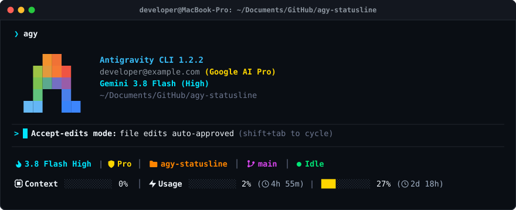

# agy-statusline

A fast, beautiful 2-line status line for Google DeepMind's **Antigravity CLI (`agy`)**.

Displays active model and tier, workspace directory, git branch, agent execution state, live context window usage, and rolling 5-hour and weekly quota gauges with countdown reset timers.

<p align="center">
  
</p>

---

## Features

- **2-Line HUD Layout**: Clean multi-line layout separating workspace identity from live telemetry and rate limits.
- **Model & Plan Display**: Shortened model name (`3.8 Flash Med`, `Sonnet 3.7`, etc.) along with current plan tier (`Pro` / `Free`).
- **Workspace & Git**: Shows current repository folder and active branch.
- **Agent Lifecycle State**: Color-coded live state (`● Idle`, `● Thinking`, `● Running`).
- **Context Window Bar**: 10-step progress bar (`█`/`░`) colored dynamically by consumption percentage (green, yellow, red).
- **Dual Quota Monitoring**: Real-time 5-hour rolling session quota and 7-day weekly quota gauges with live reset countdown timers (`4h 51m`, `3d 13h`).
- **High Compatibility**: Integrates seamlessly with `agy-hud` or runs as a self-contained pure Bash + `jq` script.
- **Smart Installer**: Auto-detects installed Nerd Fonts, offers automated one-click font installation (via Homebrew or direct archive download), and guides terminal configuration.

---

## Visual Elements

### Line 1 — Workspace & Session
| Element | Color (Tokyo Night) | Terminal Glyph | Universal / Web | Description |
|:---|:---|:---|:---|:---|
| **Model** | Sapphire Blue (`#7aa2f7`) | `nf-oct-cpu` (`U+F490`) | `⚡` / `🤖` | Active model identifier (e.g. `3.8 Flash Med`) |
| **Plan Tier** | Warm Gold (`#ffc777`) | `nf-md-shield_account` (`U+F521`) | `✦` / `🛡️` | Current subscription tier (`Pro` / `Free`) |
| **Workspace** | Warm Honey (`#e0af68`) | `nf-fa-folder_open` (`U+F07C`) | `📁` | Current working directory basename |
| **Git Branch** | Lavender Purple (`#bb9af7`) | `nf-oct-git_branch` (`U+F418`) | `⎇` | Active VCS branch |
| **Agent State** | Soft Emerald (`#9ece6a`) | `●` | `●` | Current agent state (`● Idle`, `● Thinking`, `● Running`) |

### Line 2 — Context & Quotas
| Element | Color (Tokyo Night) | Terminal Glyph | Universal / Web | Description |
|:---|:---|:---|:---|:---|
| **Context** | Dynamic Gauge | `nf-md-memory` (`U+DB80+U+DF5B`) | `🧠` | Context window fill bar and percentage |
| **Session Usage** | Dynamic Gauge | `nf-fa-bolt` (`U+F0E7`) | `⚡` | 5-hour rolling rate limit usage & reset timer |
| **Weekly Usage** | Dynamic Gauge | — | — | 7-day rate limit usage & reset timer |
| **Reset Timer** | Muted Slate (`#94a3b8`) | `nf-oct-clock` (`U+F43A`) | `⏱` | Estimated countdown duration until quota bucket resets |

> **Note**: In your terminal with a configured Nerd Font (e.g. JetBrainsMono Nerd Font), dedicated glyphs are displayed. In web browsers, universal Unicode symbols are shown below so examples render consistently without missing glyph boxes.

---

## Examples

### 1. Typical Session States

#### Standard Session (Idle)
```text
⚡ 3.8 Flash Med | ✦ Pro │ 📁 net-worth-tracker │ ⎇ main │ ● Idle
🧠 Context █░░░░░░░░░ 11% │ ⚡ Usage ██████████ 96% (⏱ 4h 51m) |  ██████░░░░ 57% (⏱ 3d 13h)
```

#### Active Command / Execution State (Running)
```text
⚡ 3.1 Pro | ✦ Pro │ 📁 agy-statusline │ ⎇ feature/hud │ ● Running
🧠 Context ████████░░ 82% │ ⚡ Usage █████████░ 88% (⏱ 1h 22m) |  ████░░░░░░ 42% (⏱ 5d 08h)
```

#### Deep Reasoning State (Thinking)
```text
⚡ Sonnet 3.7 | ✦ Pro │ 📁 backend-api │ ⎇ develop │ ● Thinking
🧠 Context ░░░░░░░░░░ 3% │ ⚡ Usage ██░░░░░░░░ 24% (⏱ 3h 10m) |  █░░░░░░░░░ 12% (⏱ 6d 19h)
```

#### High Load / Near Quota Limit Warning
When context or quota exceeds 90%, progress bars dynamically change color to red:
```text
⚡ 3.8 Flash High | ✦ Pro │ 📁 core-engine │ ⎇ hotfix │ ● Executing
🧠 Context █████████░ 94% │ ⚡ Usage ██████████ 99% (⏱ 12m) |  █████████░ 91% (⏱ 18h)
```

---

### 2. Manual Testing Examples

You can pipe JSON payloads directly into `bin/statusline.sh` to test how your terminal renders the status line under different conditions:

#### Basic Test
```bash
echo '{"model":{"id":"gemini-3.8-flash-med","display_name":"3.8 Flash Med"},"plan_tier":"Google AI Pro","agent_state":"idle","vcs":{"branch":"main"},"cwd":"/Users/username/my-project","context_window":{"used_percentage":11},"quota":{"gemini-5h":{"remaining_fraction":0.04,"reset_in_seconds":17460},"gemini-weekly":{"remaining_fraction":0.43,"reset_in_seconds":306000}},"terminal_width":120}' | bin/statusline.sh
```

#### Testing Dynamic Agent States & High Context
```bash
cat <<'EOF' | bin/statusline.sh
{
  "model": { "id": "gemini-3.1-pro", "display_name": "Gemini 3.1 Pro" },
  "plan_tier": "Google AI Pro",
  "agent_state": "running",
  "vcs": { "branch": "release/v2" },
  "cwd": "/workspace/payment-service",
  "context_window": { "used_percentage": 75 },
  "quota": {
    "gemini-5h": { "remaining_fraction": 0.20, "reset_in_seconds": 3600 },
    "gemini-weekly": { "remaining_fraction": 0.65, "reset_in_seconds": 180000 }
  },
  "terminal_width": 120
}
EOF
```

---

### 3. Configuration Examples (`~/.config/agy-hud/config.json`)

The HUD's behavior can be customized by editing `~/.config/agy-hud/config.json`:

#### Default (Usage Percentage Used)
Shows used percentage and countdown to reset (e.g. `Usage ██████████ 96% ( 4h 51m)`):
```json
{
  "show_model": true,
  "show_progress_bar": true,
  "multiline": true,
  "color": true,
  "debug": false,
  "show_git_branch": true,
  "show_cwd": true,
  "show_agent_state": true,
  "show_icons": true,
  "context_value": "percent",
  "usage_value": "used"
}
```

#### Remaining Quota Mode
To display remaining fraction instead of consumed fraction (e.g. `Usage ░░░░░░░░░░ 4% left`):
```json
{
  "usage_value": "remaining"
}
```

#### Minimal Mode (No Icons)
For environments without Nerd Fonts:
```json
{
  "show_icons": false
}
```

---

### 4. CLI Configuration (`~/.gemini/antigravity-cli/settings.json`)

The installer configures `settings.json` automatically. The corresponding configuration snippet is:

```json
{
  "statusLine": {
    "type": "command",
    "command": "bash \"$HOME/.gemini/statusline.sh\"",
    "enabled": true
  }
}
```

---

## Requirements

1. **Antigravity CLI (`agy`)**: Installed and initialized (`~/.gemini/antigravity-cli`).
2. **`jq`**: JSON processor (`brew install jq` on macOS or `sudo apt install jq` on Linux).
3. **`git`**: For branch resolution.
4. **Nerd Font**: Terminal font with glyph support (e.g. JetBrainsMono Nerd Font, FiraCode, Meslo) to display icons properly. The installer can install this for you.

---

## Installation

### Automated Install

```bash
git clone https://github.com/chahine/agy-statusline.git
cd agy-statusline
bash bin/install.sh
```

The installer will:
1. Verify system dependencies (`jq`, `git`, and `agy`).
2. Auto-detect installed Nerd Fonts or offer to install **JetBrainsMono Nerd Font** automatically.
3. Install `statusline.sh` to `~/.gemini/statusline.sh`.
4. Configure `~/.gemini/antigravity-cli/settings.json` to enable `statusLine`.
5. Display a live preview of the 2-line HUD.

---

## Uninstall

To remove the statusline configuration:

```bash
bash bin/uninstall.sh
```

---

## License

MIT
